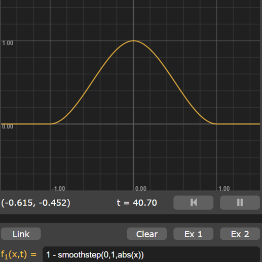
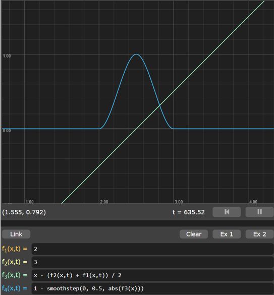
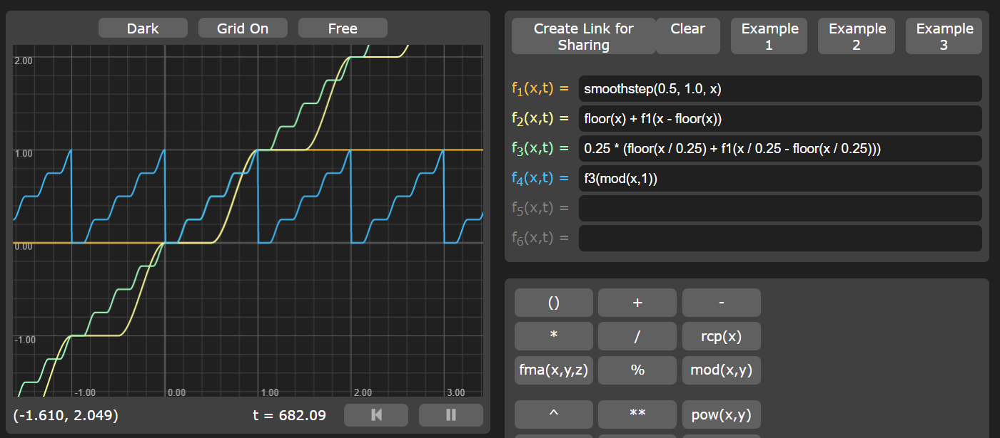
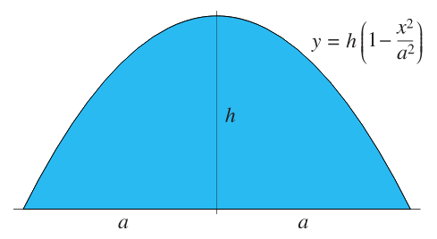
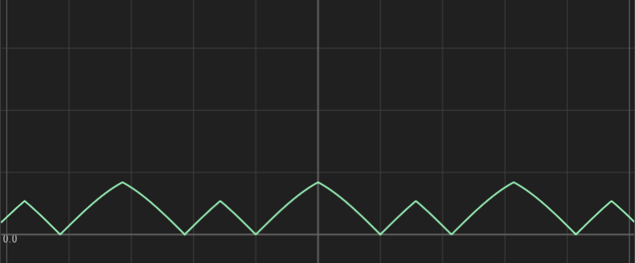
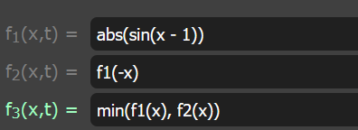

# Bell Curve between -1 and 1
`1 - smoothstep(0,1,abs(x))`

# Bell Curve between two points

# Smooth Stairstep

Based on a very good answer here:
https://math.stackexchange.com/questions/1671132/equation-for-a-smooth-staircase-function

> Let `s:[0,1]→[0,1]` be a smooth function representing a single step. Assume that there exists some `ϵ>0` such that `s(x)=0` for all `x<ϵ` and `s(x)=1` for all `x>1−ϵ`. Setting
> `f(x)=s(x−⌊x⌋)+⌊x⌋`
> then gives us a smooth staircase with steps of height and width 1. By rescaling f, we can get steps of arbitrary width w and height h:
> `f(h,w,x)=hf(x/w)=h(s(x/w−⌊x/w⌋)+⌊x/w⌋)`

# Parabola of desired width and height

# Sharp mountain like stuff
[Link](https://graphtoy.com/?f1(x,t)=abs(sin(x%20-%201))&v1=false&f2(x,t)=f1(-x)&v2=false&f3(x,t)=min(f1(x),%20f2(x))&v3=true&f4(x,t)=&v4=false&f5(x,t)=&v5=false&f6(x,t)=&v6=false&grid=1&coords=0,0,5.089171420469821)

