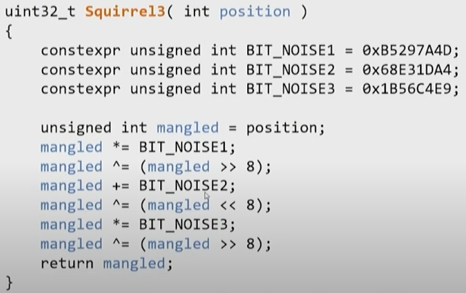
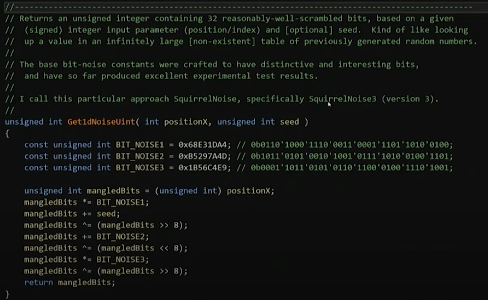

# Reading

Credits: Squirrel Eiserloh
Very nice video about RNGs and noise. Goes into examples and various of qualities of RNGs.
https://www.youtube.com/watch?v=LWFzPP8ZbdU

Squirrel3 Hash function:

SquirrelNoise3 (with seed):

# Convert 1D Noise to 2D/3D noise

From this video: https://www.youtube.com/watch?v=LWFzPP8ZbdU

# PCG: Interesting random number generator

https://www.pcg-random.org/useful-features.html#multiple-streams-sequences

# Interesting things from Probability and Statistics

For further reading:

https://en.wikipedia.org/wiki/Central_limit_theorem

https://en.wikipedia.org/wiki/Box%E2%80%93Muller_transform
