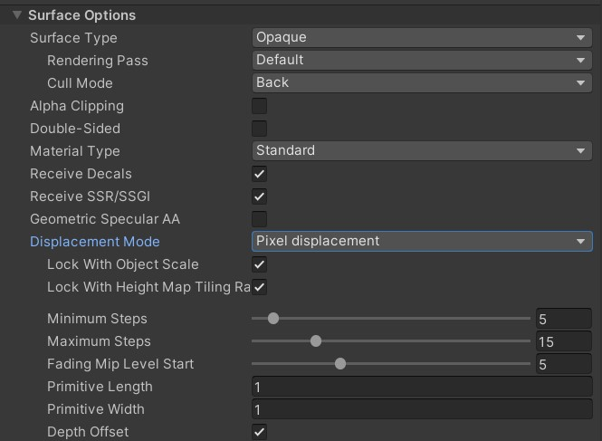

# Customizg HDRP Example

Amazing article (in Japanese) about how to customize HDRP's default shader's components (various passes) to support raymarching, while getting all the benefits of HDRP's built in lighting:
https://nanka.hateblo.jp/entry/2019/08/27/004905

Nice article about writing custom raymarchers while supporting depth/shadows/perspective/orthographic:
https://bgolus.medium.com/rendering-a-sphere-on-a-quad-13c92025570c#3835

> :warning: If you are overriding the passes in HDRP shaders (e.g., DepthOnly, GBuffer), and want to output per-pixel depth, make sure you have "pixel displacement" enabled in the shader (so that you can use the SV_Depth semantics). Otherwise you will most likely get a flat depth output on raymarched materials (unless they are extremely tesselated).  

# Shaders from strings
https://answers.unity.com/questions/21429/creating-a-material-from-shader-string.html