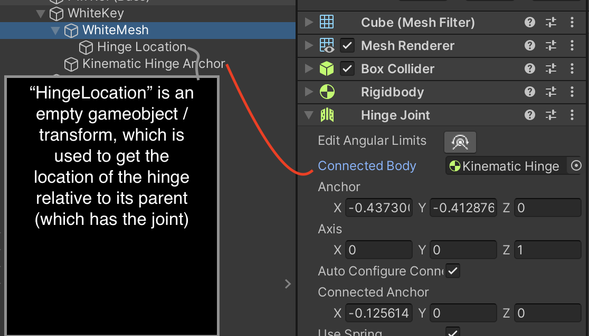

## Scenario

You need a hinge joint, where the moving part is not kinematic, but you want to be able to move the whole rig using `transform.position`

If you just have a single rigidbody with a hinge joint on it, it is anchored to a world space position. If you have a spring on the joint, it will pull the object back to the world space position, even if you move the parent transform.

## Solution

Attach a **kinematic rigidbody** to the hinge joint.

